 

The Spring to Life Drop brings variety to the overworld by adding new mob variants and some nice ambient features, like fallen
trees and wildflowers.

These additions bring life to the overworld forests, however there are still some features that might be added
which would fit the drop's theme...

So here's this mod, adding more ambient features like hollow logs, new mobs, firefly jars and more! 🦋

-------------------------

### 🌸 Features

#### FIREFLY JARS

Fireflies from a Firefly Bush can now be caught using a glass bottle.

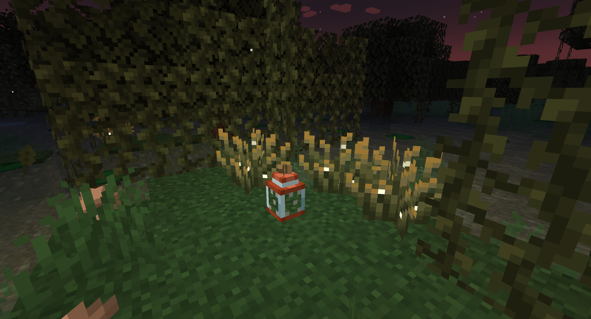

Up to 5 fireflies can be put in a Firefly Jar. The block's light level depends on the amount of fireflies.

A Firefly Bush contains a random amount of fireflies that can be caught before being "empty".

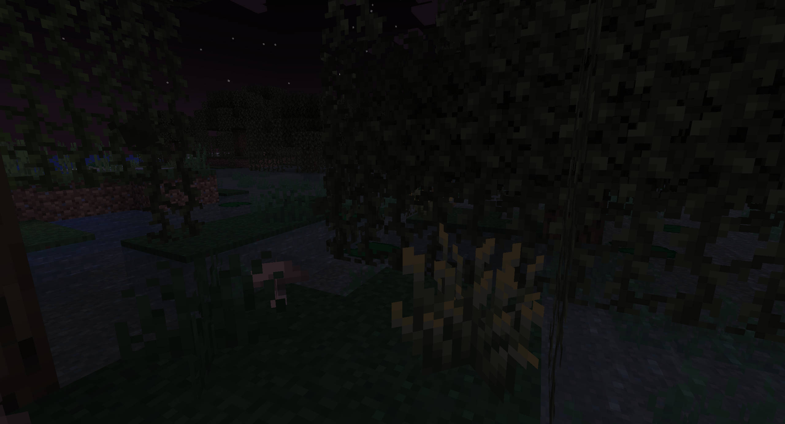

After a while, fireflies will reappear inside the bush at night.

#### HOLLOW LOGS

When the Wild Update was first introduced, a concept art for the Birch Forest was shown, showcasing some hollow logs.

Now, with this mod, you can find and get these hollow logs for all kind of wood types!

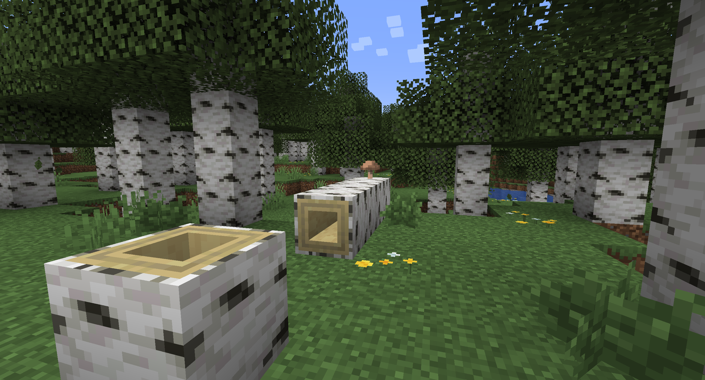

Fallen trees with hollow logs might generate in forest biomes (like regular fallen trees).

You can hollow a log by shift-right clicking a regular log, which can then also be stripped.

Hollow logs can also be waterlogged

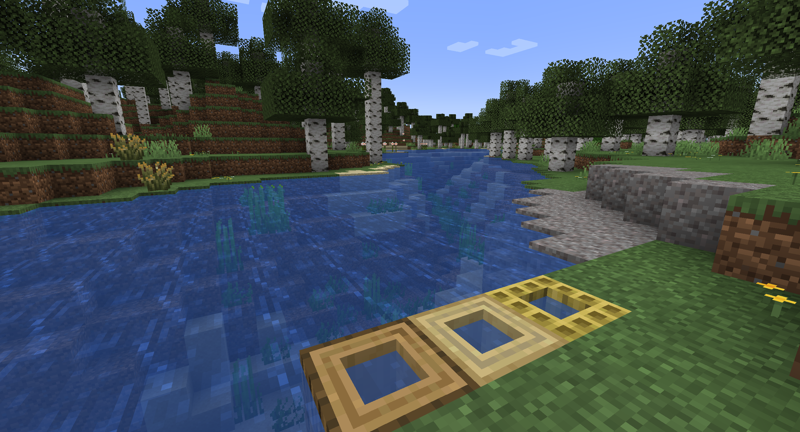

### MUSHROOMS ON LOGS

Red and Brown mushrooms can now be placed on the Logs sides.

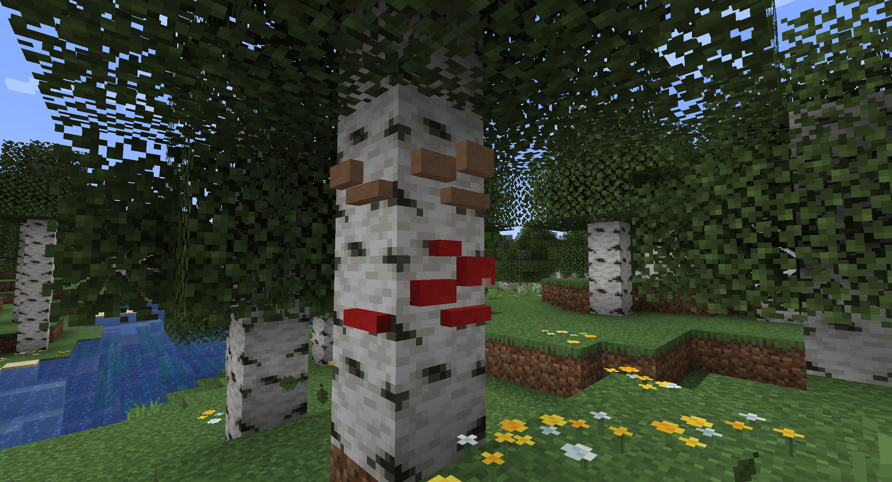

Up to 4 mushrooms of the same type can be placed in one block

#### LEAF PILES

When Leaf Litters were announced, everyone thought they would be stackable, like snow layers. Unfortunately that is not the case,
but fear not because Leaf Piles have been added!

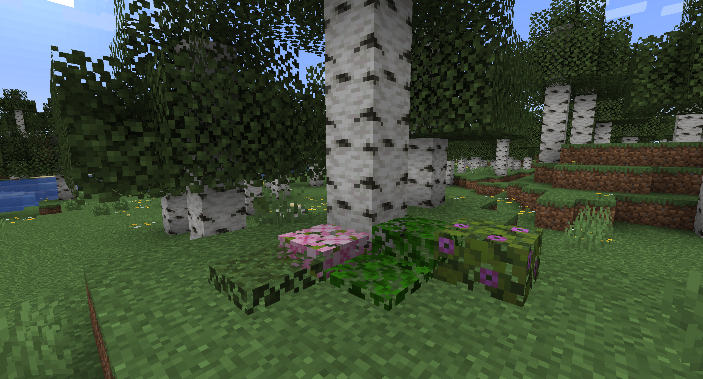

Leaf Piles are crafted using, well, Leaves, like a snow layer

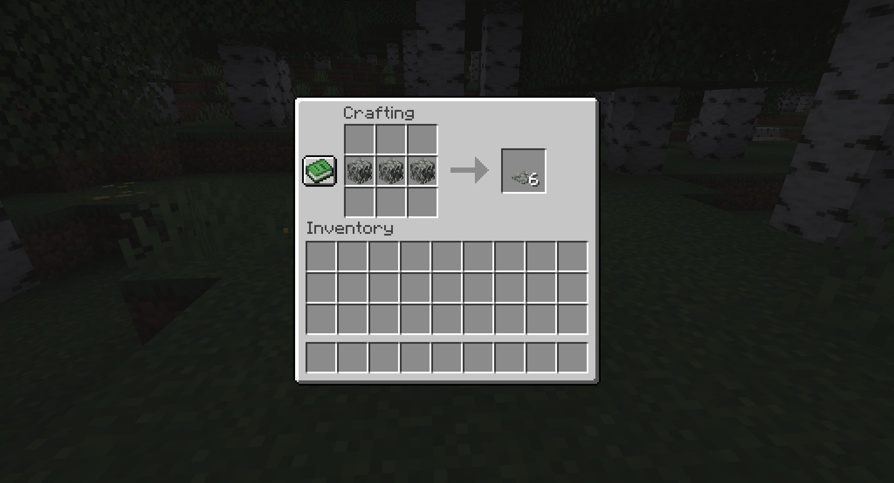

Leaf Piles can also be waterlogged!

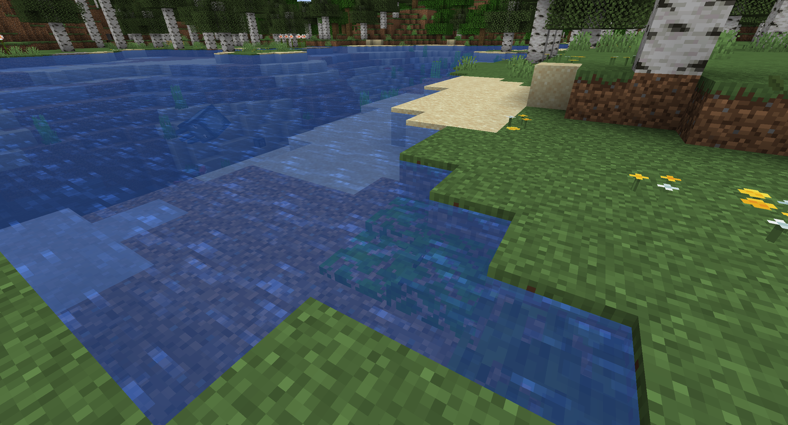

#### SNOWY AND MORE POTTED PLANTS

We got cold and hot variants of mobs. We also got hot variant of grass. But why no cold variant?

Introducing the Snowy Grass, Snowy Tall Grass and Snowy Bush!

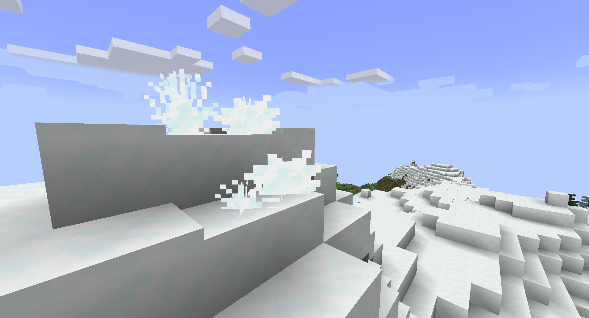

Snowy Plants can be found in Snowy Biomes and can also be placed on Snow and Powder Snow

They can be potted, as well as other plants like Cactus Flower, Bush, Short and Tall Dry Grass

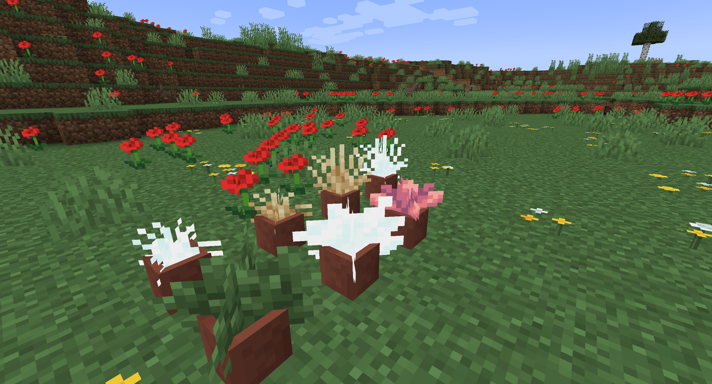

Also, Bushes and Snowy Bushes can be smelted into Dead Bushes

### PRICKLY PEARS CACTUS

Cactus will now spawn more frequently in Wooded Badlands nad they can sometimes grow Prickly Pears on top, like they do with Cactus Flowers.

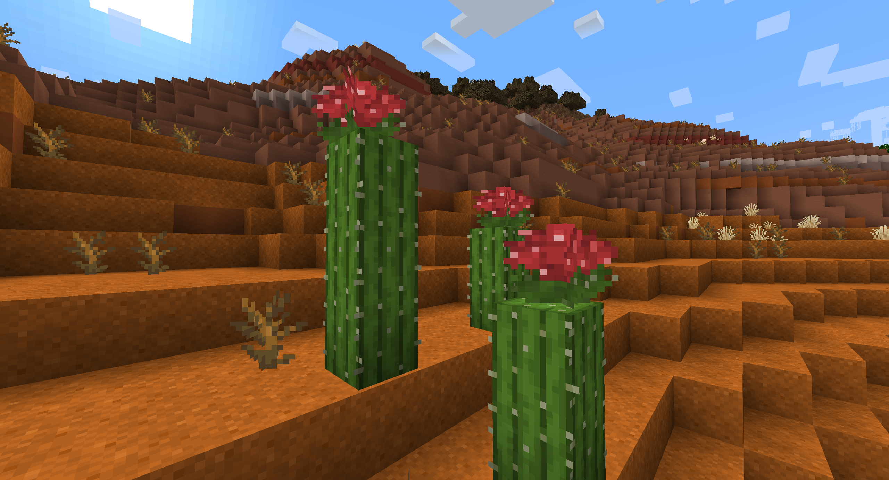

Prickly Pears can be eaten and will restore a fair amount of hunger

They can be potted

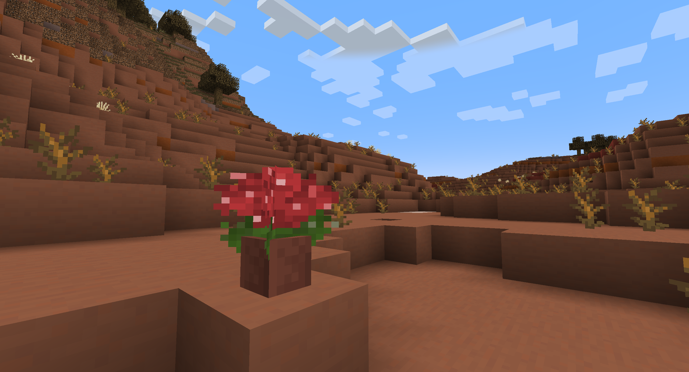

### ASPHODEL

A new two-blocks tall flower will spawn in Old Growth Birch Forests: the Asphodel

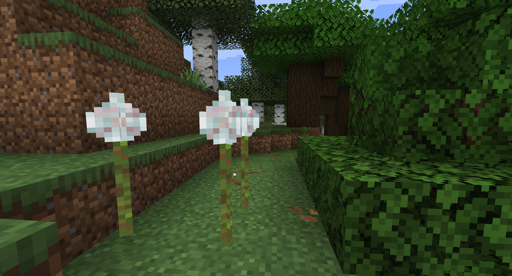

Asphodels will randomly produce some subtle particles around their tips, can be used to breed and tempt bees and can be crafted into white dye

### MOOBLOOM AND BUTTERCUP

You've read that right: Mooblooms are here!

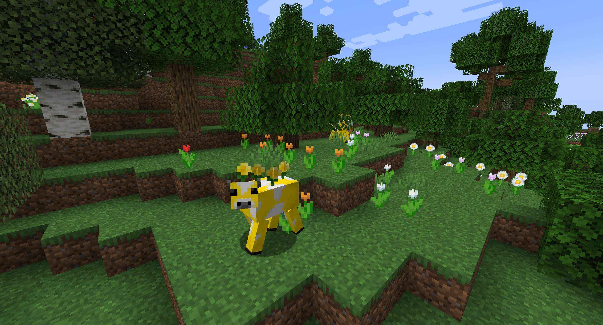

Mooblooms will sometime spawn in Flower Forests and have 4 new flowers on top of them: the Buttercup.

Using a shear on them will drop 4 buttercups, which will then take 5 minutes to regrow.

Using a bowl on them will give a Suspicious Stew with the Absorption effect (same as if crated with a Buttercup).

The Buttercup doesn't generate naturally in any biome, so the only way to get them is to find a Moobloom.

Buttercups can be potted and can be turned into yellow dye

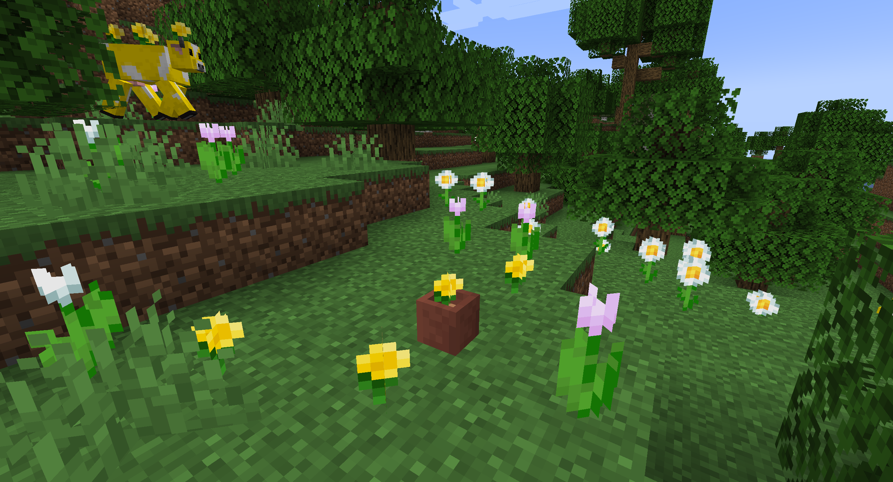

### MUDDY PIGS

Another great feature taken from Minecraft Earth is the Muddy Pig.

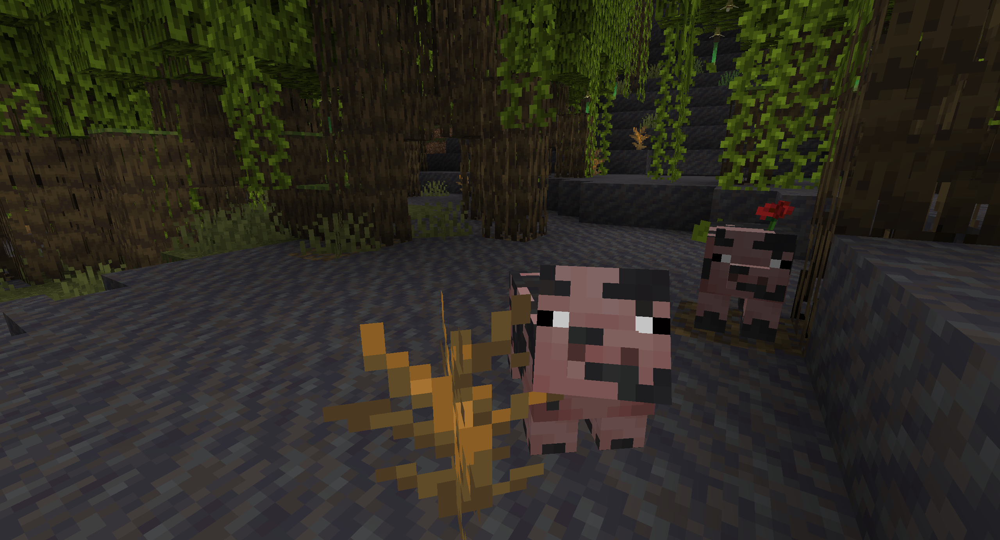

Muddy Pigs spawn in Mangrove Swamps and might have a Poppy on them.

When sheared, the poppy will drop and won't regrow.

Muddy Pigs can also be washed using a Water Bucket, which makes them turn into a Temperate Pig

Baby Muddy Pigs will never have a flower, as well as any Muddy Pig that comes from breeding 

### BUTTERFLIES

A new ambient mob has been added to Forest biomes: the butterfly.

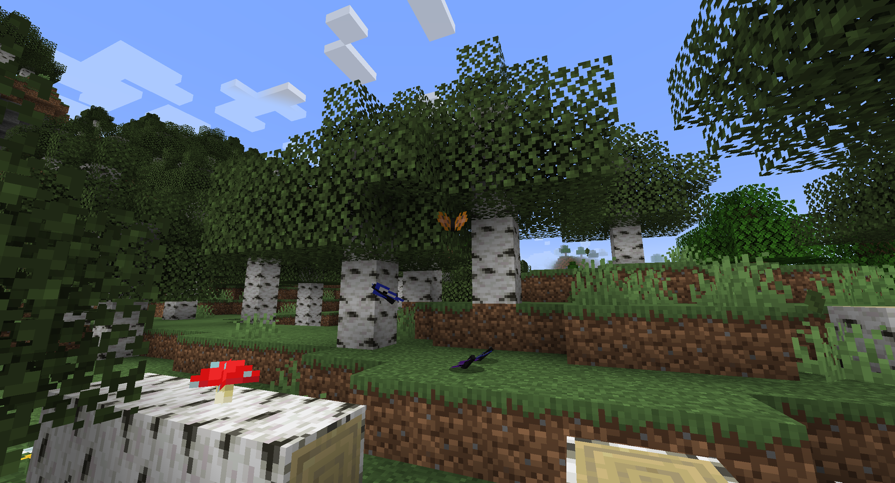

Butterflies are very weak and drops nothing.

Can be tempted using small flowers

### NEW MUSIC DISC: SWEDEN

Sweden by C418 has been added as a new Music Disc.

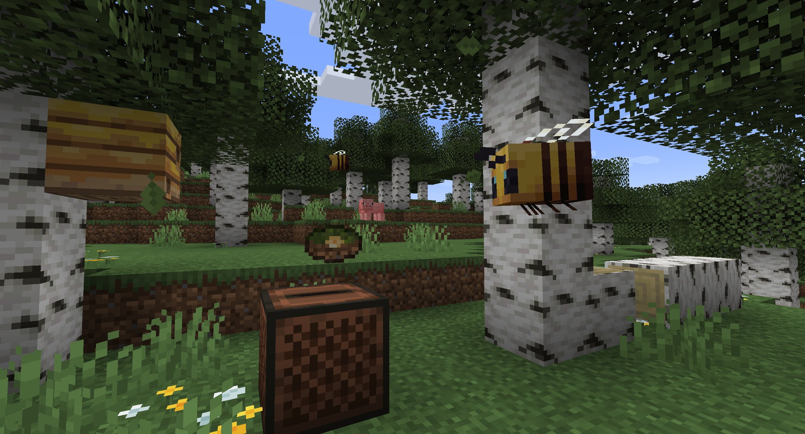

This new Music Disc can be found in a new structure, the campsite, and gives a comparator output of 15

### CAMPSITES

Campsites will sometime generate in Forest, Birch Forest and Taiga biomes.

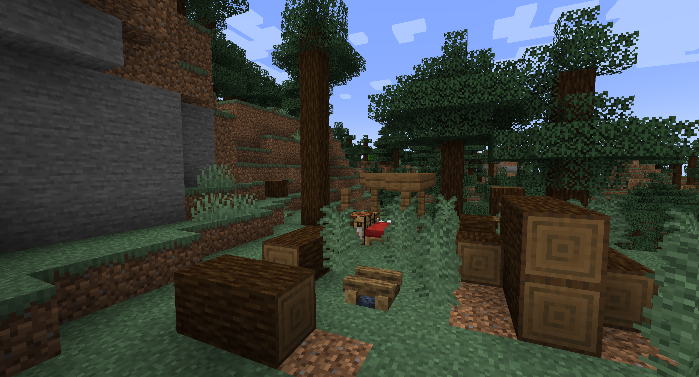

The chest contains various loot, including the new Music Disc, some Logs, some food and some Stone or Wooden Tools.

-------------------------

### 👨🏼‍💻 How to contribute

Anyone can contribute to Better Spring to Life, suggesting their ideas [using the Feature Request module](https://github.com/JimiIT92/BetterSpringToLife/issues/new?assignees=JimiIT92&labels=enhancement&template=feature_request.md&title=)

If your idea makes it to the mod you'll also be mentioned in the mod's credits! 😁

-------------------------
### ⚙ Requirements

No additional mods are required.

-------------------------
### 🖥 Downloads

You can download Better Spring to Life on [CurseForge](https://www.curseforge.com/minecraft/mc-mods/hendrixs-better-spring-to-life) or [Modrinth](https://modrinth.com/project/hendrixs-better-spring-to-life/versions).

**I will post new releases only there**.

Any other websites that offers you Better Spring to Life shouldn't be trusted and should be reported immediately (as they could be a scam and contain malicious software)!

-------------------------
### 🍺 Support the project

Developing and maintaining Better Spring to Life, requires a lot of time and effort,
but after all I really enjoy doing this ❤

Better Spring to Life is, and **<ins>always</ins>** will be, **<ins>FREE TO USE</ins>**.

If someone asked you some money to download Better Spring to Life, I am afraid to tell you that you got scammed! 😥

But if you **really** want to financially support the project (or just buy me some beer to produce more code), these are the only ways:

&emsp;&emsp;&emsp;&emsp;&emsp;

Any other website asking you money for this project is a scam, and you should immediately report it to your local authorities as well! 😡

-------------------------
### 😁 Conclusion

The Spring Drop brings some fresh air to the Minecraft's Overworld, and with this mod you can get an "even fresher" air!

I hope you enjoy Better Spring to Life as much as I enjoy develop new ideas and content for it,
and let me know if there are any issues on the [issue tracker](https://github.com/JimiIT92/BetterSpringToLife/issues/new?assignees=JimiIT92&labels=enhancement&template=bug_report.md&title=).

Have a nice day! 😁
